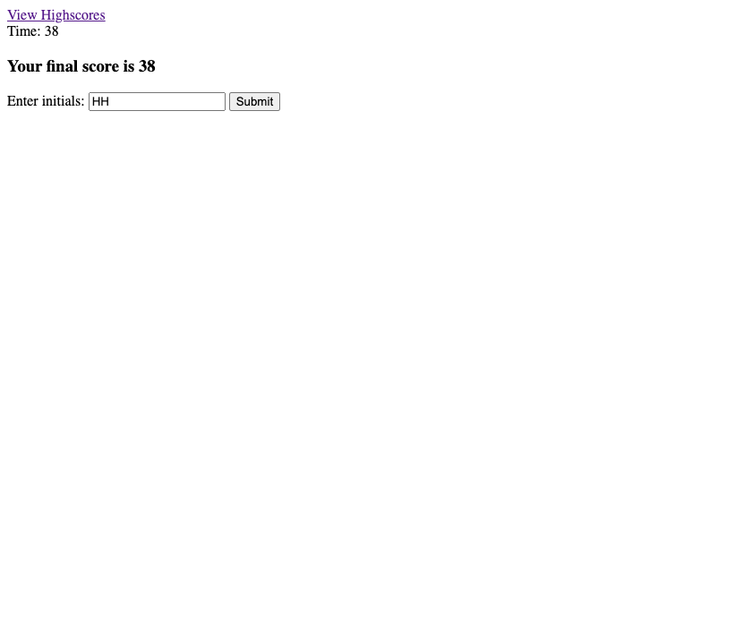

# Short-Quiz
This application is a short code quiz. It asks five questions and is timed. If the user answers a question wrong 10 seconds are subtracted from the timer. The more time left at the end of the quiz the better. The high scores are then placed in local storage and show on the page(not yet active).

